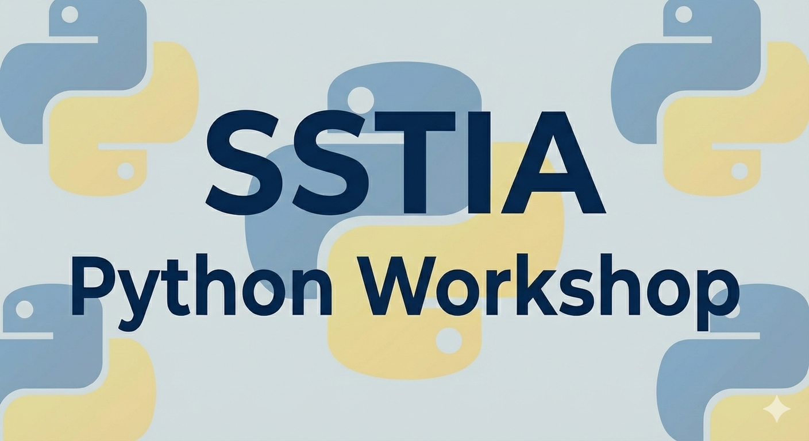

This repository contains all the code for SSTIA Python workshop. It has 4 parts in total: Introduction to Python, Python OOP tutorial, Common libraries tutorial and a project for practice. Designed for SJTU Global College students.

# Instructions

The workshop resources are designed to be completed during the workshop, but are also available for you to complete at your own pace.

## Opening the workshop in Google Colaboratory

The 2026 SSTIA Python Workshop will be run in Google's Colaboratory(Colab), a Jupyter notebook environment that runs entirely in the cloud, so you don't need to download anything. To run these Jupyter notebook files, ***you must have a Google account***.

On this GitHub repo, navigate to the [workshop folder](https://github.com/Trilobit-coder/PythonWorkshop/blob/main/workshop) and open the appropriate Python notebook (\*.ipynb). Click the "Run in Colab" link on the top of the notebook. That's it!

## License

All code in this repository is copyright 2026 SSTIA Python Workshop. All Rights Reserved.