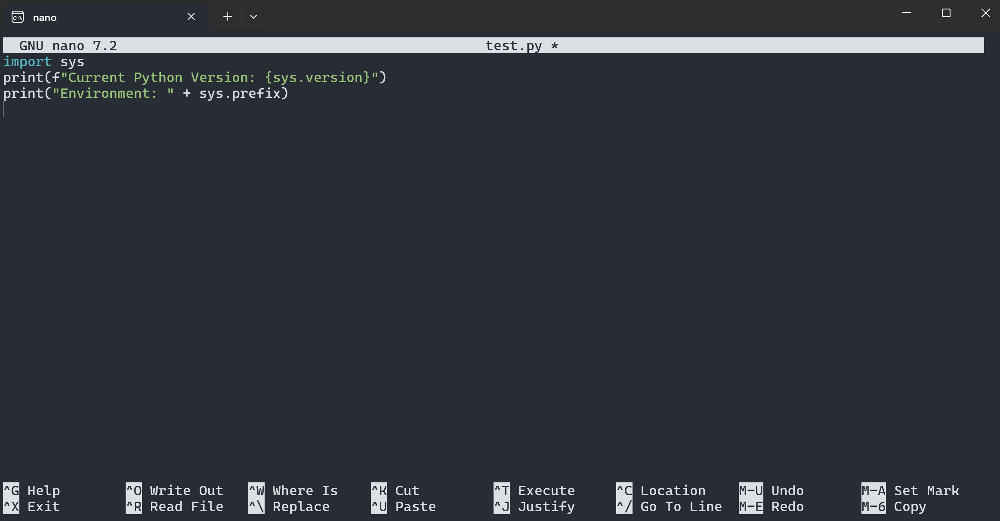
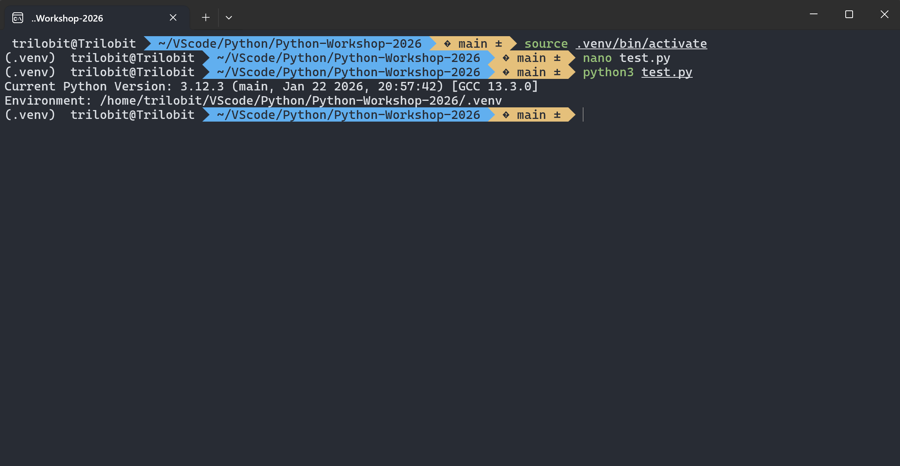

# Python + VS Code on macOS

This guide will help you set up a professional development environment on macOS (Intel or Apple Silicon).

## 1. Install VS Code

On macOS, you have two primary ways to install VS Code.

### **Option A: Manual Download (Easiest)**

1. Visit [code.visualstudio.com](https://code.visualstudio.com/).
2. Download the `.zip` for macOS.
3. Drag **Visual Studio Code** from your Downloads folder to your **Applications** folder.

### **Option B: Using Homebrew (Pro Way)**

If you have [Homebrew](https://brew.sh/) installed, simply run:

```bash
brew install --cask visual-studio-code

```

## 2. Prepare Python

MacOS usually comes with a version of Python 3 pre-installed by Apple, but it is often outdated and shouldn't be messed with. It's best to install a fresh version via Homebrew.

1. **Install Homebrew** (if you haven't yet):

```bash
/bin/bash -c "$(curl -fsSL https://raw.githubusercontent.com/Homebrew/install/HEAD/install.sh)"
```

1. **Install Python**:

```bash
brew install python

```

## 3. Clone Our Workshop Repo

Time to grab the code. Open your **Terminal** (Cmd + Space, type "Terminal") and navigate to where you want to keep your work (e.g., `cd Documents`).

```bash
git clone https://github.com/UMJI-SSTIA/Python-Workshop-2026.git
cd Python-Workshop-2026

```

## 4. The Workflow: Virtual Environments

To keep your Mac's system clean, we keep our project libraries inside a virtual environment.

### **Create the environment**

```bash
python3 -m venv .venv
```

### **Activate it**

```bash
source .venv/bin/activate
```

> **Note:** Once activated, your terminal prompt will usually show `(.venv)` at the beginning.

## 5. Verification

Let’s ensure your Mac is looking at the right Python. We'll use the built-in `nano` editor to create a quick test script.

1. **Create the file**:

```bash
nano test.py
```

1. **Paste this code**:

```python
import sys
print(f"Current Python Version: {sys.version}")
print("Environment: " + sys.prefix)

```



1. **Save and Exit**: Press `Ctrl + O` (then Enter) to save, and `Ctrl + X` to exit.
2. **Run the code**:

```bash
python3 test.py

```



If the "Environment" path ends with `Python-Workshop-2026/.venv`, you are perfectly set up.

## 6. Launching VS Code

Now, let's move from the terminal into the editor. While inside your project folder in the terminal, type:

```bash
code .

```

*(If this command doesn't work, open VS Code manually, press `Cmd + Shift + P`, type "shell command", and select **"Install 'code' command in PATH"**.)*

Now configure your VS Code

***See [vscode_setup](https://github.com/UMJI-SSTIA/Python-Workshop-2026/tree/main/setup/share/vscode_setup) inside the share folder***
