# Jupyter Notebook Configuration

## 1. Installing Anaconda on Windows

1. Getting the Installation Package from the official website: <https://www.anaconda.com/download/success>

2. Click “Next” and “I Agree” to begin the installation process.

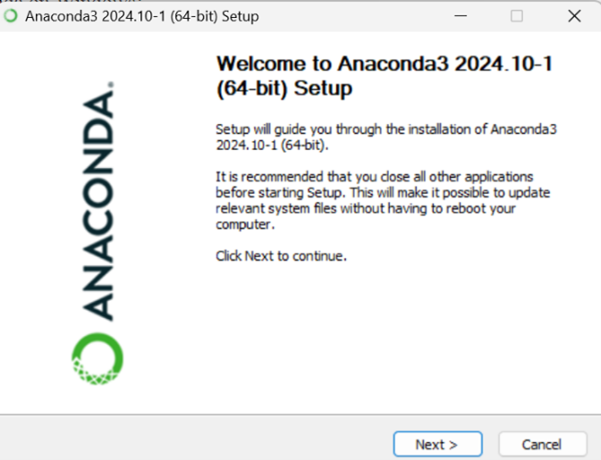

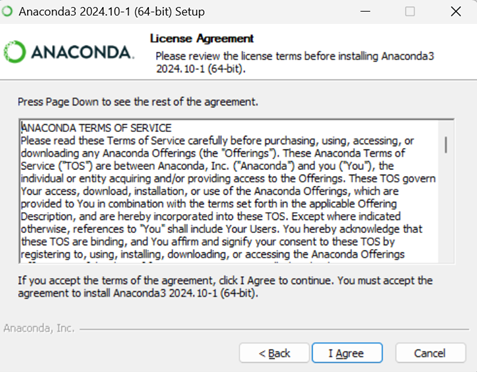

3. Choose "Just Me" option.

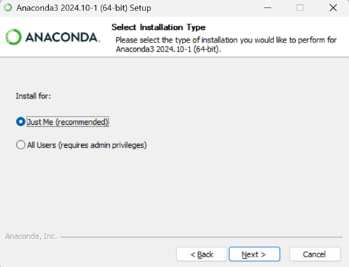

4. Select the installation location (it is recommended to use the default location).

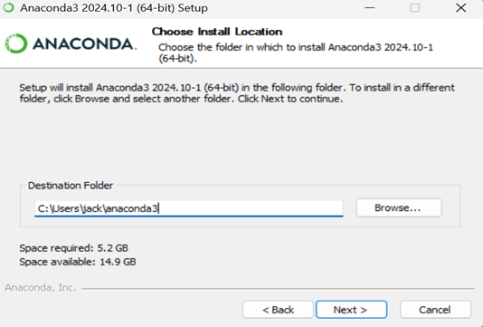

5. In the next window, check the following options:

- Add Anaconda to my PATH environment variable: This ensures that Anaconda is added to the system’s PATH. **(Or you should manually add the environment variables, see the following part)**
- Register Anaconda as my default Python 3.12: This sets Python 3.12 as the default version.

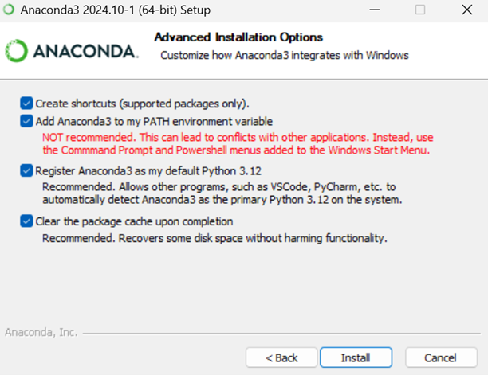

- After the installation is complete, click "Next" and then click "Finish" to complete the installation.

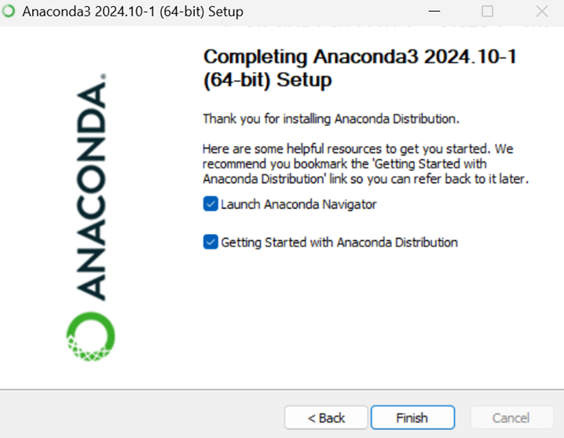

## 2. Manually Add Environmental Variables

! 如果前面勾选了“Add Anaconda to my PATH environment variable: This ensures that Anaconda is added to the system’s PATH.”，则不用手动改环境变量。

1. Press the Windows key and search path (编辑系统环境变量)

2. Press the Environmental Variable(环境变量)

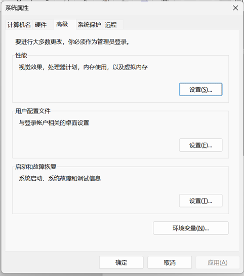

3. Choose ‘Path’ in the system variables and press ‘Edit’.

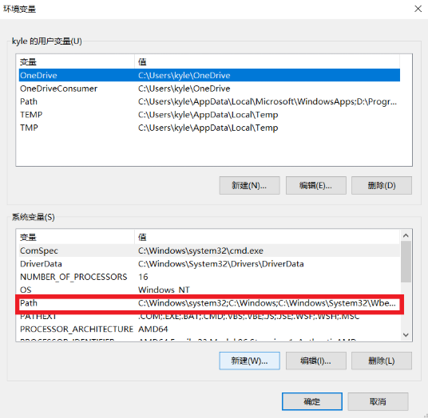

4. Fill in the following 3 paths based on your installation path. The beginning of the path will be different, but the ending part will be the same.
The paths should end with \Anaconda3, \Anaconda3\Library\bin, and \Anaconda3\Scripts.

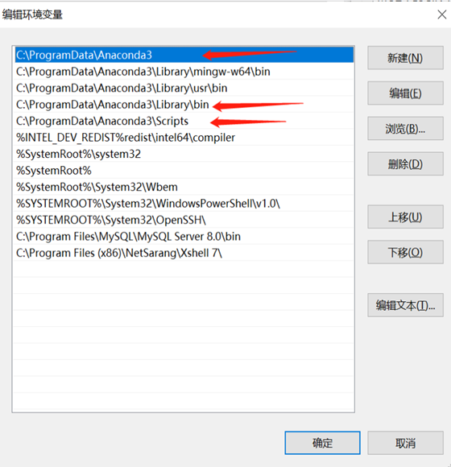

## 3. Configure Python and Jupyter Notebook Environment in VSCode

1. Install VSCode and Python in the official website:
<https://www.python.org/downloads/>
<https://code.visualstudio.com/Download>

2. Install the Python and Jupyter extensions in VSCode

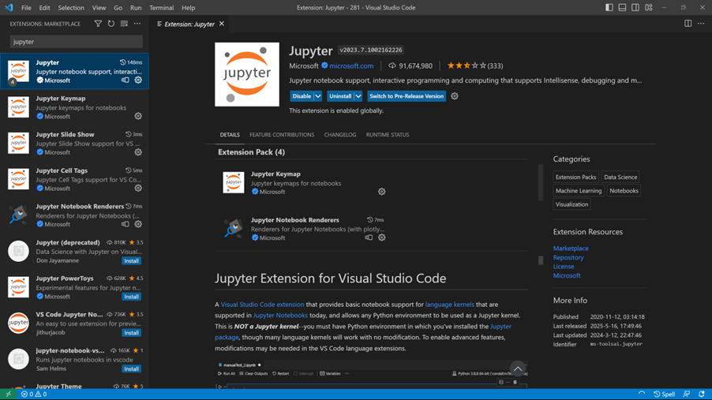

3. Run pip install jupyter in the terminal.（Windows系统: cmd/PowerShell/VS Code 里的终端窗口）

4. Open a .ipynb file and choose the kernel.

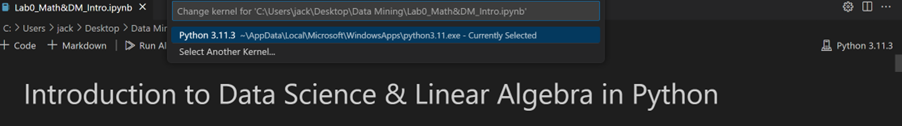
