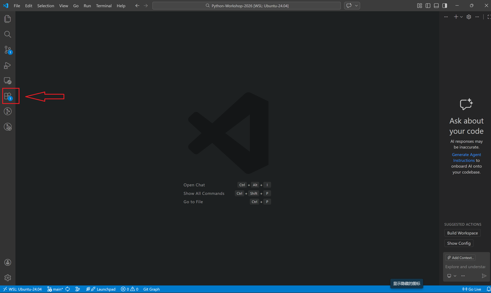
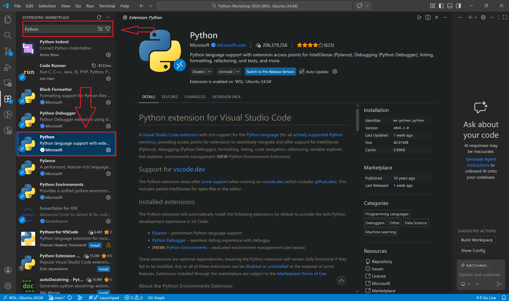
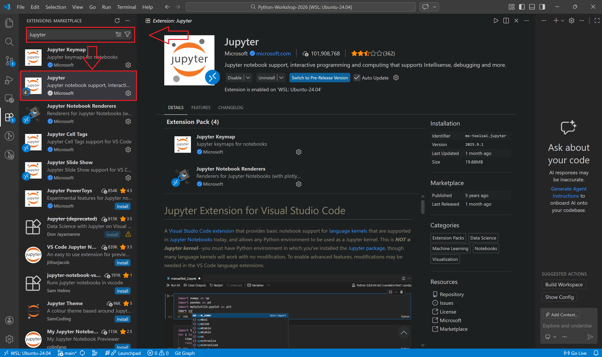
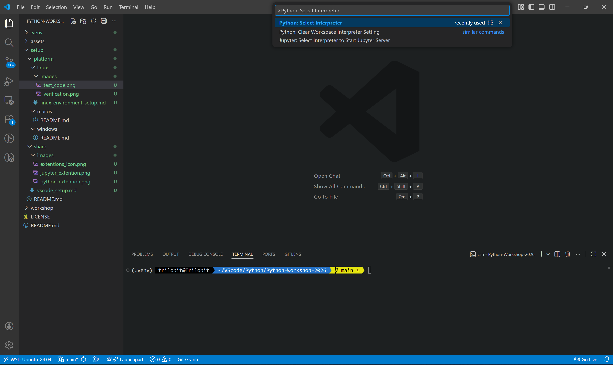
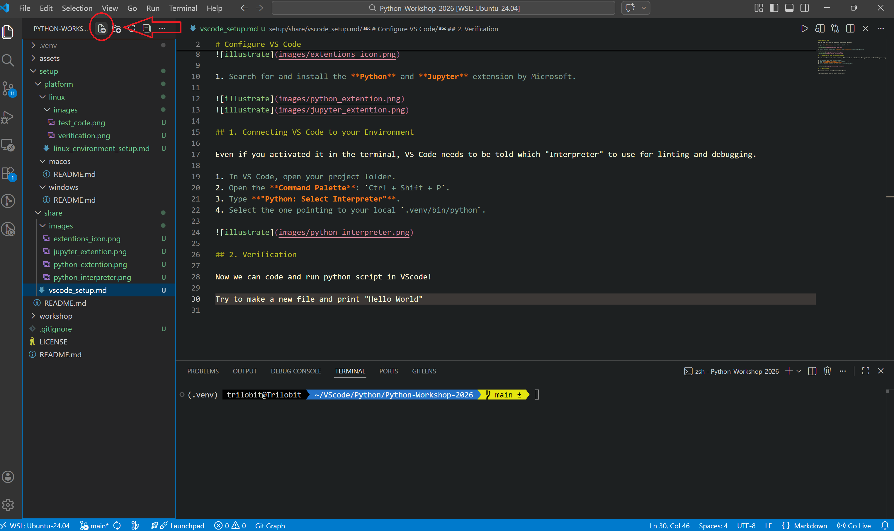
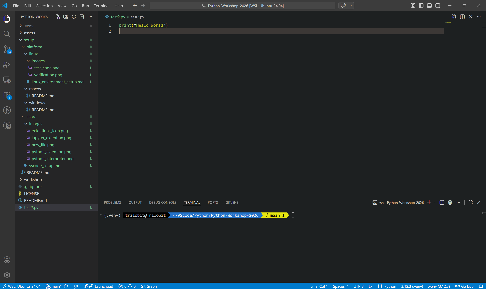
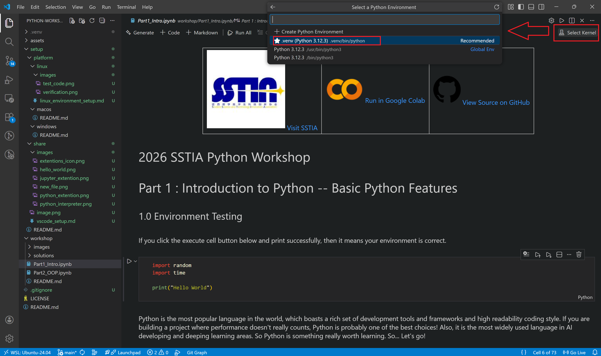
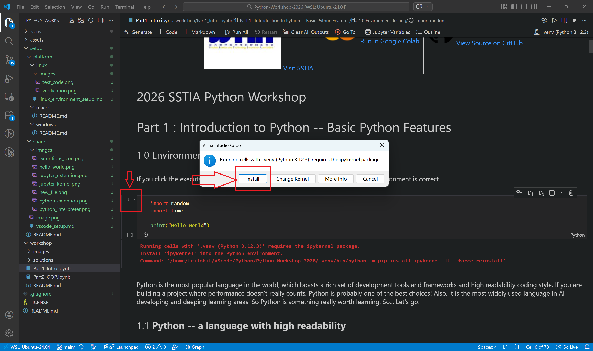

# Configure VS Code

Open VS Code and let's get the right tools under the hood.

1. Open the **Extensions** view (`Ctrl + Shift + X`).



1. Search for and install the **Python** and **Jupyter** extension by Microsoft.




## 1. Connecting VS Code to your Environment

Even if you activated it in the terminal, VS Code needs to be told which "Interpreter" to use for linting and debugging.

1. In VS Code, open your project folder.
2. Open the **Command Palette**: `Ctrl + Shift + P`.
3. Type **"Python: Select Interpreter"**.
4. Select the one pointing to your local `.venv/bin/python`. (If you are using virtual environment)



## 2. Verification

Now we can code and run python script in VScode!

Try to make a new file named "test2.py" and print "Hello World"



Don't forget the quote marks! Don't forget the ".py" filename extension

```py
print("Hello World")
```



Click "F5" (Or "Fn+F5" in some computer) to run the code (You may need to select python debugger the first time, just select the first one), and you will see "Hello World" printed in the terminal below, that's it!

## 3. Jupyter in VScode

We have already experience running Python code in script with ".py" extension. In fact, we can also run Python code in notebook with ".ipynb" extension. This is Jupyter notebook, which allows you to mix Python code with markdown, ipython and many other languages.

Open the nootbook Part1_Intro.ipynb in workshop folder, and click "select kernel" in the top right corner and choose "Python Environments"->".venv"

"Part1_Intro.ipynb"->"select kernel"->"Python Environments"->".venv"



Then click the "Execute Cell" button in the first cell, and you will see a warning to let you install a required package, just install it.



Then click the "Execute Cell" button again, you will see the "Hello World" printed again. Congratulations！All setups are finished, enjoy the coding!
